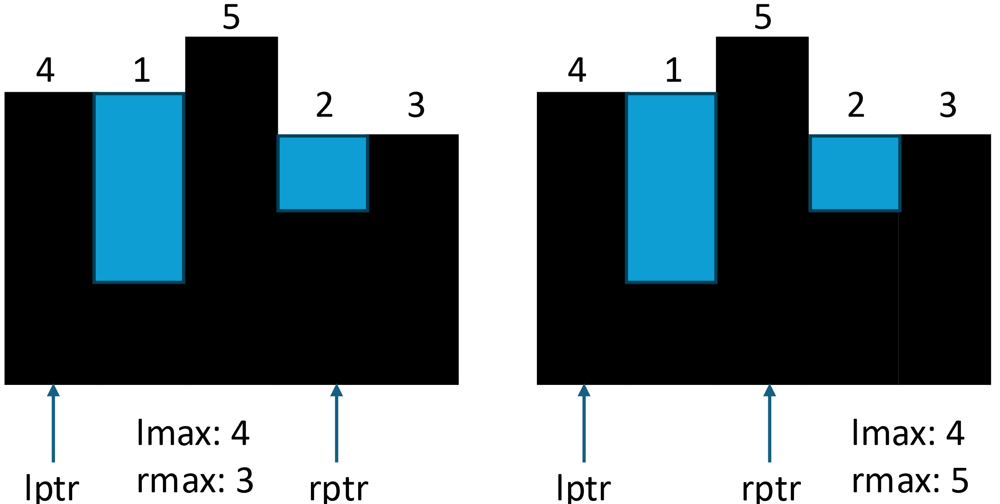

# 42. Trapping Rain Water

[🔗 **Source**](https://leetcode.com/problems/trapping-rain-water/description/)

## Intuition
<!-- Describe your first thoughts on how to solve this problem. -->
For this question, we should note that the height of water in `height[i]` is determined by the minimum of its "left maximum" and "right maximum"

`res[i] = Math.max(lmax[i], rmax[i]) - height[i]`


## Solution 1

Use array `lmax` and `rmax` to store the "left maximum" and "right maximum" for each index and iterate the `height` array to get the total volumn.

### Complexity
- Time complexity: $O(N)$
- Space complexity: $O(N)$

### Code
``` java linenums="1"
class Solution {
    public int trap(int[] height) {
        int len = height.length;
        int[] lmax = new int[len];
        int[] rmax = new int[len];
        int total = 0;

        lmax[0] = height[0];
        for (int i = 1; i < len; i++) {
            lmax[i] = Math.max(lmax[i-1], height[i]);
        }

        rmax[len - 1] = height[len - 1];
        for (int i = len - 2; i >= 0; i--) {
            rmax[i] = Math.max(rmax[i+1], height[i]);
        }

        for (int i = 0; i < len; i++) {
            total += Math.min(lmax[i], rmax[i]) - height[i];
        }
        
        return total;
    }
}
```

## Solution 2

Use two pointers to store the left maximum and right maximum. This approach optimize the space complexity.

- `lmax` < `rmax`:  we can learn that on the "left part", the height of water must be determined by `lmax`
- Similarly, if `lmax` >= `rmax`, we can conclude that on the "right part", the height of water must be determined by `rmax`

    

### Complexity
- Time complexity: $O(N)$
- Space complexity: $O(1)$

### Code
``` java linenums="1"
class Solution {
    public int trap(int[] height) {
        int l = 0;
        int r = height.length - 1;
        int lmax = 0;
        int rmax = 0;
        int total = 0;
        
        while (l < r) {
            lmax = Math.max(lmax, height[l]);
            rmax = Math.max(rmax, height[r]);

            if (lmax < rmax) {
                total += lmax - height[l];
                l++;
            } else {
                total += rmax - height[r];
                r--;
            }
        }
        return total;
    }
}
```

### Similar Question

- [Trapping Rain Water II](../400+/407.%20Trapping%20Rain%20Water%20II.md)