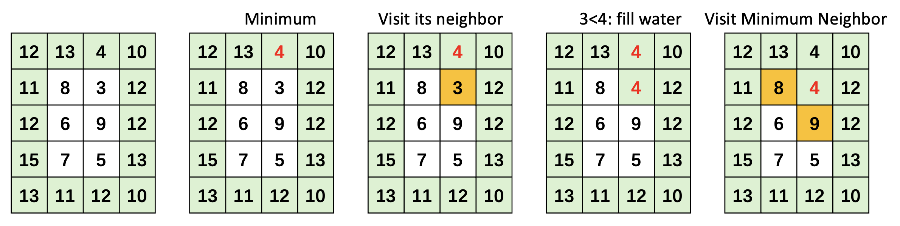

# 407. Trapping Rain Water II

[🔗 **Source**](https://leetcode.com/problems/trapping-rain-water-ii/description/)

## Approach

Refer to [this artical](https://cloud.tencent.com/developer/article/2416271)

After calculating each position, in order to facilitate the search for the minimum value each time, we can **add the calculated position to the minimum heap**, and then continue to take the minimum value from the heap next time, and calculate its four directions of up, down, left, and right.

For example, since 4 is the minimal value on the boundary, visit its neighbour(3), note that 3 < 4, then for 3, it can fill 1 unit water, after visit 3 and fill the water, we need to update its height.

Similarly, pick the minimum of the boundary, which is "updated 3", visit its neighbour 8 and 9, note that 9 > 8 > 4, then we can not fill water at 8 and 9. So we mark 8 and 9 as visit and continue....



## Complexity
- Time complexity: $O(M*N*\log(M*N))$
- Space complexity: $O(M*N)$

## Code
``` java linenums="1"
class Solution {
    public int trapRainWater(int[][] heightMap) {
        PriorityQueue<int[]> pq = new PriorityQueue<>(
            Comparator.comparingInt((int[] a) -> a[2]));
        int m = heightMap.length;
        int n = heightMap[0].length;
        boolean[][] visited = new boolean[m][n];

        // Add the boundary value to priority queue
        for (int i = 0; i < m; i++) {
            for (int j = 0; j < n; j++) {
                if (i == 0 || j == 0 || i == m - 1 || j == n - 1) {
                    pq.offer(new int[] {i, j, heightMap[i][j]});
                    visited[i][j] = true;
                }
            }
        }

        // Initialize the count variable and location array of up, down, left and right.
        int total = 0;
        int[][] loc = {{0, -1}, {0, 1}, {1, 0}, {-1, 0}};

        // Traverse the priority queue
        while (!pq.isEmpty()) {
            int[] nums = pq.poll();
            for (int[] l : loc) {
                int x = nums[0] + l[0];
                int y = nums[1] + l[1];
                if (x < 0 || y < 0 || x > m - 1 || y > n - 1 || visited[x][y]) {
                    continue;
                }
                visited[x][y] = true;
                total += Math.max(0, nums[2] - heightMap[x][y]);
                pq.add(new int[]{x, y, Math.max(nums[2], heightMap[x][y])});
            }
        }

        return total;
    }
}
```

## Similar Question

- [Trapping Rain Water](../1+/42.%20Trapping%20Rain%20Water.md)